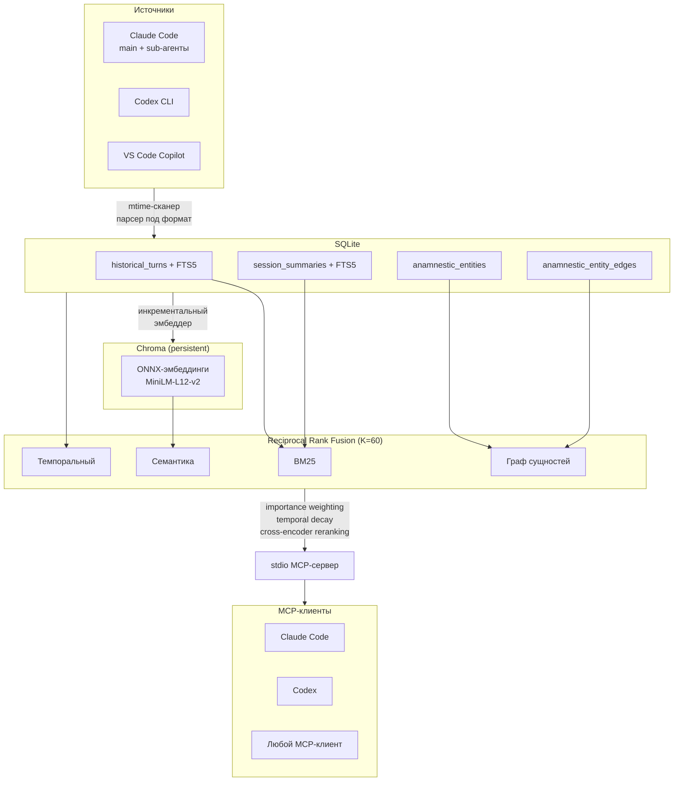

# anamnestic

Персистентная память с гибридным поиском для сессий AI-CLI.

Собирает исторические транскрипты из **Claude Code** (main + sub-агенты), **Codex CLI** и **VS Code Copilot** в единый корпус. Даёт гибридный поиск (BM25 + семантика + темпоральный + граф сущностей → RRF-слияние) и отдаёт результаты обратно клиентам как MCP-инструменты.

Построено как слой-расширение поверх [`claude-mem`](https://github.com/thedotmack/claude-mem): переиспользует его SQLite-файл как базовую схему и добавляет собственные таблицы, индексы и сервисы. Оба сосуществуют, не конфликтуя.

```
pip install anamnestic
```

## Зачем

- Транскрипты рабочих сессий с AI-агентами накапливаются между проектами и клиентами. Grep по jsonl — медленно и семантически слепо; сами клиенты всё забывают между запусками.
- MCP-сервер, который на `mem_search("запрос")` возвращает ранжированные реплики из любой прошлой сессии, превращает архив в адресуемую поверхность знаний.
- Только BM25 пропускает парафразы. Только семантика не видит точных токенов (IP, CVE, пути). Четырёхканальный RRF даёт каждому каналу шанс вытащить релевантное.

## Архитектура



## Поисковый пайплайн

Четыре канала извлечения, объединённые через RRF:

| Канал | Источник | Что находит |
|-------|----------|-------------|
| **BM25** | FTS5 по turns + саммари | Точные токены, пути к файлам, ошибки |
| **Семантика** | Chroma cosine similarity | Парафразы, концептуально похожий контент |
| **Темпоральный** | SQL по диапазону дат (EN/RU) | «вчера», «на прошлой неделе», «in March» |
| **Граф** | BFS по co-occurrence сущностей | Связанные turns через общие пути/URL |

Пост-фьюжн этапы:
- **Importance weighting** — повышает turns с кодом, ошибками, решениями
- **Temporal decay** — экспоненциальный полураспад (по умолчанию 90 дней), свежие результаты выше
- **Cross-encoder reranking** — ONNX MiniLM перескорирует top-20 для финальной точности

Каждый ответ поиска включает диагностику по каналам.

## Контроль качества графа сущностей

- **Минимальный вес ребра** — одноразовые co-occurrence (weight < 2) отсекаются как шум
- **IDF-нормализация** — `score = weight / log₂(degree + 1)` подавляет сущности-хабы, поднимает редкие дискриминативные

## MCP-инструменты

| Инструмент | Назначение |
|------------|------------|
| `mem_search` | Гибридный поиск с выбором режима (hybrid/bm25/semantic) |
| `mem_probe` | Оракул покрытия — «встречается ли этот токен?» |
| `mem_entity` | Поиск по сущности — «что мы делали с этим файлом?» |
| `mem_get_turn` | Получить turn с окружающим контекстом |
| `mem_get_session` | Обзор сессии с метаданными |
| `mem_get_thread` | Цепочка продолжений — все связанные сессии |
| `mem_stats` | Статистика корпуса |
| `mem_audit_tail` | Последние записи телеметрии |

## CLI

```bash
anamnestic sync       # ingest + embed + обогащение (сущности, потоки, importance, саммари, граф)
anamnestic search "запрос"
anamnestic status     # снимок здоровья корпуса
anamnestic verify     # проверки целостности (FTS, drift, сироты)
anamnestic backup     # WAL-safe tar (хранит последние 10)
anamnestic restore    # восстановление из бэкапа
anamnestic audit      # лог последних операций
anamnestic eval       # регрессионный тест по golden-запросам
anamnestic archive    # архивация старых low-importance turns
```

## Установка

Полная инструкция — установка, бэкфилл, регистрация MCP, systemd-таймеры, переезд — в **[SETUP.md](SETUP.md)**.

## Принципы дизайна

- **Файл — единица идемпотентности.** `anamnestic_ingest_state` хранит `(source, path, mtime_ns)`; повторный запуск пропускает неизменённые файлы.
- **Turn — единица хранения.** `historical_turns` с UNIQUE-ключом `(content_session_id, turn_number)`; UPSERT не плодит дубликаты.
- **Формат — ответственность парсера.** Добавить новый CLI-агент = написать парсер в `anamnestic/ingest/` и зарегистрировать glob.
- **Каждая операция аудируется.** `anamnestic_audit` логирует sync/verify/backup/restore с длительностью и JSON-payload.
- **Auto-sync при старте MCP.** Лёгкий ingest + embed при запуске сервера — данные всегда актуальны.

## Тесты

93 теста, покрывающие все модули:
- Интеграционные тесты полного RRF-пайплайна (формула скора, multi-channel merge, importance, decay, граф, диагностика)
- Unit-тесты importance scoring, temporal parsing, decay, entity extraction, graph traversal, reranking, threading, summarization, parsers, MCP server

```bash
pytest tests/ -v   # <1с
```

## Лицензия

[MIT](LICENSE)
